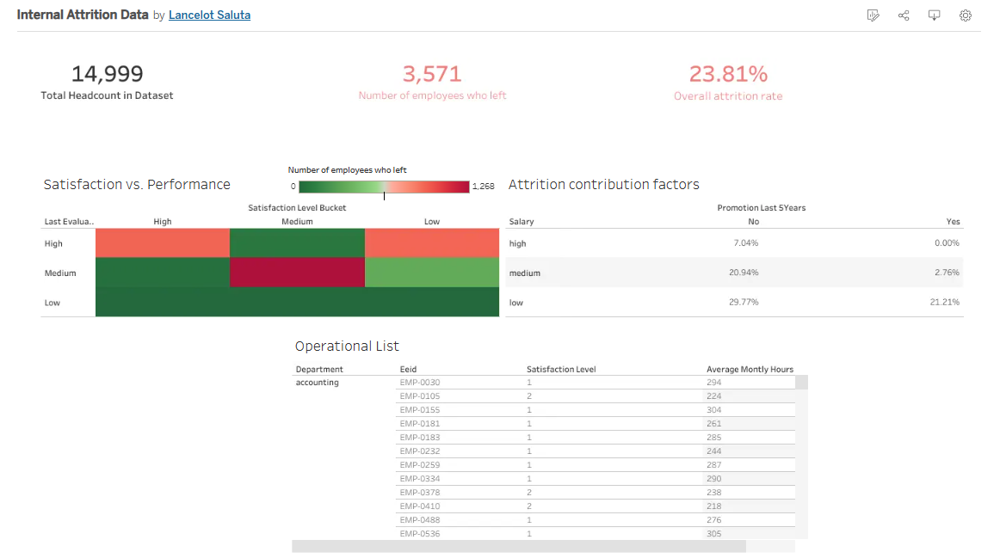

# Internal Compensation & Workforce Attrition Analysis

## Project Overview
This project analyzes regional compensation structures and workforce metrics across a global dataset of 15,000 employees. The goal was to identify different factors contributing to attrition. The dataset is sourced from Kaggle.com

## Live Interactive Dashboard
You can view and interact with the full, live dashboard here: 
[View Interactive Tableau Dashboard](https://public.tableau.com/views/InternalAttritionData/Dashboard1?:language=en-US&:sid=&:redirect=auth&:display_count=n&:origin=viz_share_link)

## Dashboard Preview
Below is a snapshot of the primary analytics interface built for HR stakeholders:

## Key Business Insights
* **Key attrition driver:** Identified that the highest driver for attrition are low salaries.
* **Stagnation:** Employees who had no upward mobility in their roles were also at risk of leaving.
* **High-performer flight risks:** Discovered was that the high performers in the company were also a flight risk

## Data Methodology & Tools
* **Excel / Power Query:** Used for end-to-end data extraction, transformation, and structural schema validation (ETL).
* **Tableau Public:** Utilized to build dynamic data products and cross-functional reporting workflows for management.
